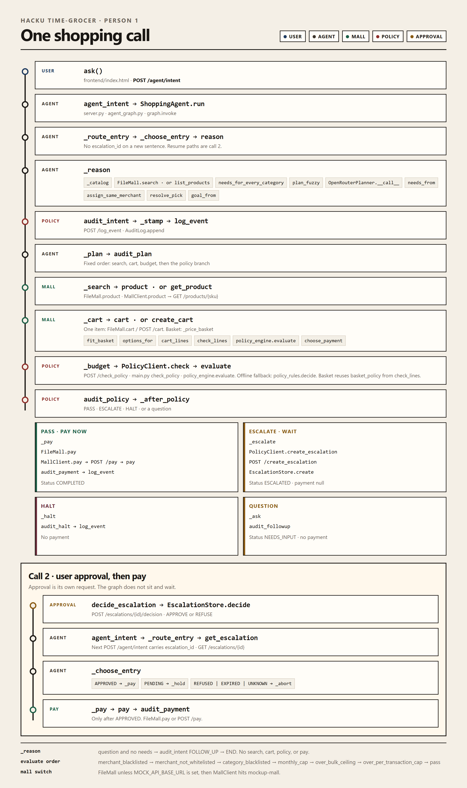

# One call



Default mall is `FileMall` (`fake_mall/__init__.py`).
If `MOCK_API_BASE_URL` is set, the same method names go through `MallClient` to `mockup-mall/mock-api/main.py`.

## Call 1 — new intent

```
frontend/index.html ask()
  POST /agent/intent
    server.py agent_intent
      agent_graph.py ShoppingAgent.run
        graph.invoke
          route_entry          _route_entry
          _choose_entry        → reason
          reason               _reason
            _catalog
              FileMall.search("")
              MallClient.search → GET /products → list_products
            needs_for_every_category          basket.py
              or plan_fuzzy
                _is_meal_plan / _days / _budget / _grocery_guess
              or OpenRouterPlanner.__call__    openrouter.py
                _user_message
                parse_decision
                normalize_sell_point          pick.py
            normalize_react
            needs_from
            assign_same_merchant              only if same shop or a named shop
              named_merchant / wants_same_merchant
              choose_best_merchant
                _score_merchant
                _estimate_landed
            resolve_pick                      one item
              _match_query
            goal_from
          audit_intent         _audit
            _stamp
            PolicyClient.log_event
              POST /log_event → main.py log_event → AuditLog.append
          plan                 _plan
          audit_plan           _audit → log_event
          search_products      _search
            FileMall.product
            MallClient.product → GET /products/{sku} → get_product
          audit_search         _audit → log_event
          price_cart           _cart
            one item
              FileMall.cart
              MallClient.cart → cart_lines → POST /cart → create_cart
            basket             _price_basket
              fit_basket
                options_for
                _draft
                mall.cart_lines → POST /cart → create_cart
                _merge
                PolicyClient.check_lines
                  PolicyClient.check
                    POST /check_policy → main.py check_policy → policy_engine.evaluate
                    else policy_rules.decide
                _swap_illegal / _best_swap / _blocked_lines     only if a rule fires
                choose_payment
                  _load_offers
          audit_cart           _audit → log_event
          check_budget         _budget
            basket: already in basket_policy from check_lines
            one item: PolicyClient.check → evaluate | decide
          audit_policy         _audit → log_event
          _after_policy
            PASS        → execute_payment
            ESCALATE    → create_escalation
            HALT        → halt
            question    → ask
          execute_payment      _pay
            FileMall.pay
            MallClient.pay → POST /pay → pay
          audit_payment        _audit → log_event
        build_react
        ActionPlan
```

## Call 1b — amount over HK$500, wait for approval

Same spine until `_after_policy`. Then:

```
create_escalation      _escalate
  PolicyClient.create_escalation
    POST /create_escalation
      main.py create_escalation
        policy_engine.evaluate          category sent as ""
        EscalationStore.create          escalations.py
audit_escalation       _audit → log_event
  returns status ESCALATED, payment null
```

User approval is a separate request, not a graph node:

```
POST /escalations/{escalation_id}/decision
  main.py decide_escalation
    EscalationStore.decide
      APPROVE → AuditLog.append ESCALATION_APPROVED
      REFUSE  → AuditLog.append ESCALATION_REFUSED
```

## Call 2 — approval comes back, then pay

```
POST /agent/intent          body.escalation_id set
  server.py agent_intent
    ShoppingAgent.run
      route_entry            _route_entry
        PolicyClient.get_escalation
          GET /escalations/{id} → main.py get_escalation → EscalationStore.get
      _choose_entry
        APPROVED → execute_payment
        PENDING  → hold
        REFUSED | EXPIRED | UNKNOWN → abort
      execute_payment        _pay
        FileMall.pay | MallClient.pay → POST /pay → pay
      audit_payment          _audit → log_event
```

## Stops that skip the tools

```
_reason question and no needs     plan_fuzzy or the model
  audit_intent FOLLOW_UP
  _after_intent → END              no search, no cart, no policy, no pay

_after_policy HALT → halt → audit_halt → END
_after_policy question → ask → audit_followup → END
_choose_entry PENDING → hold → audit_hold → END
_choose_entry REFUSED | EXPIRED | UNKNOWN → abort → audit_abort → END
```
