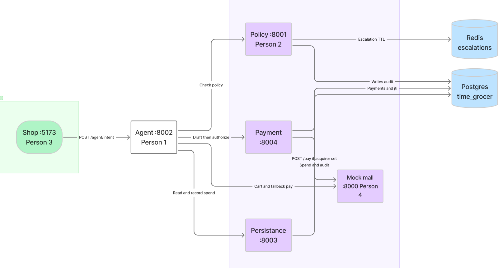
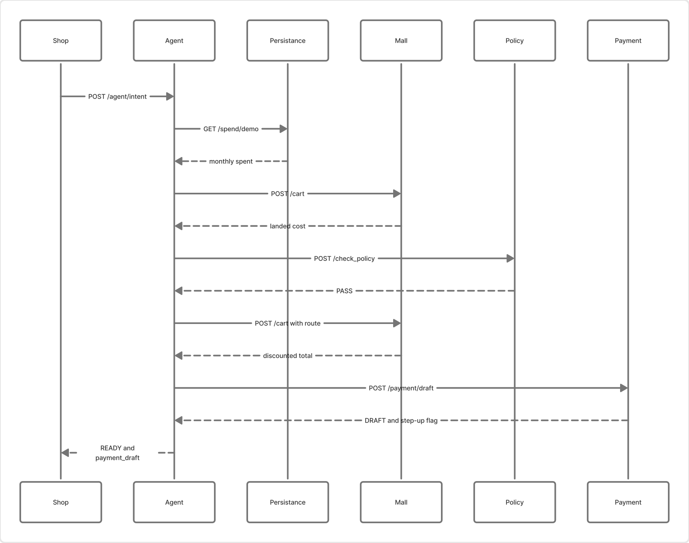
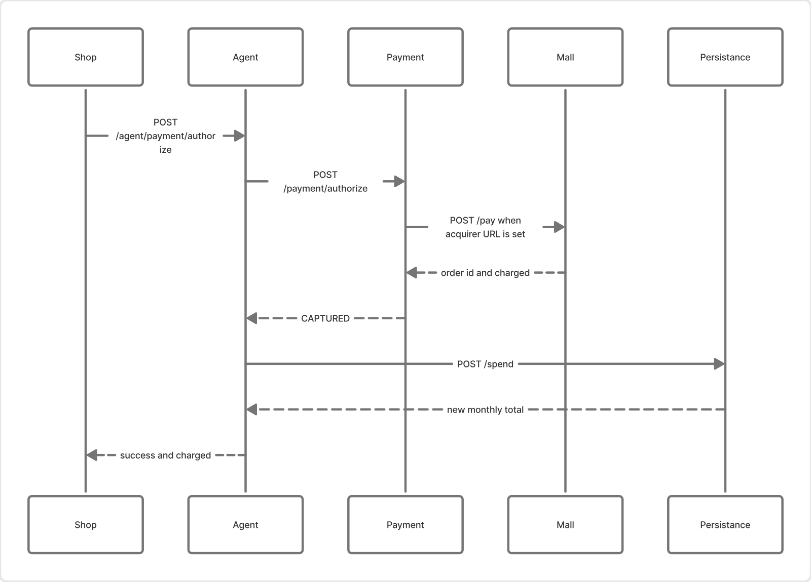
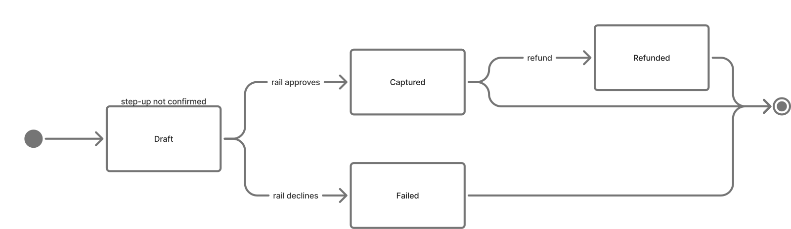

# How the backend fits together

The shop talks only to the agent. The agent is the one that calls policy, the mall, payment, and persistance.

FigJam board (editable): [Backend modules](https://www.figma.com/board/wXzX3wa4N2rqWQJIgHt37S)

## Who owns which port

| Person | Module | Port | What it is for |
|---|---|---|---|
| Person 3 | Shop | 5173 | Sends the shopper’s sentence and, later, the confirm click |
| Person 1 | Agent | 8002 | The only backend the shop calls. Runs the plan |
| Person 2 | Policy | 8001 | PASS, ESCALATE, or HALT. Owns approval create and decide |
| Person 4 | Mock mall | 8000 | Catalog, cart price, and the mock card charge |
| Shared | Persistance | 8003 | Monthly spend and the audit log |
| Shared | Payment | 8004 | Scoped token, rail charge, step-up, dispute pack |

Postgres (`time_grocer` on 5432) holds the audit log, monthly spend, and the `payments` / `payment_jti` rows. Redis (6379) holds escalation timers. Person 2 writes those timers. Persistance does not expose create or decide.

This is the stack in [PR #2](https://github.com/ToneKode/HackU-Time-GrocerPoC/pull/2) and [PR #3](https://github.com/ToneKode/HackU-Time-GrocerPoC/pull/3). [PR #1](https://github.com/ToneKode/HackU-Time-GrocerPoC/pull/1) is the closed persistance wiring those two build on.

## What each person calls

**Person 3** sends `POST /agent/intent` with the sentence and `monthly_spent`. After a draft comes back, the confirm click is `POST /agent/payment/authorize` with `payment_id` and `step_up_confirmed`. Cart, pay, policy, and the payment draft are calls the agent makes.

**Person 1** reads `GET /spend/{account}` before judging the basket, then asks the mall to price it. Policy sees that landed total. On PASS, the agent prices the cart again with the chosen route, drafts a payment for the discounted total, and returns status `READY` with `payment_draft` filled in and `payment` empty. Authorize is a second call. After a capture, the agent writes `POST /spend`.

**Person 2** receives `POST /check_policy` for each line and once for the basket total. Over HK$500 per transaction escalates. Over HK$800 is the bulk ceiling. Over HK$2000 monthly spend halts. Escalations live 10 minutes in Redis. A decision is `POST /escalations/{id}/decision` on port 8001.

**Person 4** prices `POST /cart`. With `payment_route` set, Mastercard takes 1% off and UnionPay takes 1.5% off. `total_landed_cost` becomes the reduced figure, and `total_before_discount` keeps the original. `POST /pay` charges whatever total it is given. A total of HK$666.00 returns `card_declined`.

**Payment** mints a one-time token on `POST /payment/draft`, stores the row in Postgres, and returns the draft without the token. `POST /payment/authorize` burns the token id in `payment_jti` and charges the rail. If `MOCK_ACQUIRER_URL` points at the mall, that charge is `POST /pay`. Otherwise the rail runs inside the payment process. `GET /payment/{id}/evidence` is the dispute pack. It also omits the token.

## Two totals, on purpose

Policy judges the first cart total, before cashback. A basket of HK$500 stays an escalation even if UnionPay would bring the charge under HK$500. The payment draft uses the discounted total. `payment.charged` is that reduced number.

Example from the agent tests: cheap toilet paper lands at HK$59.90. Policy PASSes on 59.90. Mastercard cashback is HK$0.60, so the capture is HK$59.30.

## A normal purchase

The shopper is not charged on this first picture. The agent stops at `READY`.

The mall hop in that second picture happens when `MOCK_ACQUIRER_URL` is set. With it empty, payment still returns `CAPTURED` from its in-process rail, and the agent still records spend.

If port 8004 is down, the agent skips the draft and calls the mall `/pay` immediately, which is how the older agent tests still finish. If port 8001 is down, the agent uses the same HK$ caps locally. If port 8003 is down, it uses the `monthly_spent` value the shop sent.

## Payment states

| From | To | When |
|---|---|---|
| Draft | Draft | Step-up was required and `step_up_confirmed` was false. HTTP 403 `step_up_required`. The token is still unused |
| Draft | Captured | The rail approves. Authorize auto-captures, so the shop sees `CAPTURED` in one response |
| Draft | Failed | The rail declines, including a cart total of HK$666.00 |
| Captured | Refunded | `POST /payment/{id}/refund` |

A second authorize of a captured payment returns the same receipt. The token can be used once.

Step-up is separate from Person 2’s HK$500 gate. HK$400 or more scores 55 and stays `DRAFT` until the shop sends `step_up_confirmed: true`. HK$150–399 scores 25, and a route that is not the recommended rail adds 25. Step-up starts when the score reaches 50.

The planner inside the agent can call OpenRouter. `USE_SCRIPTED_PLANNER=true` skips that and still walks the same mall, policy, and payment calls.
